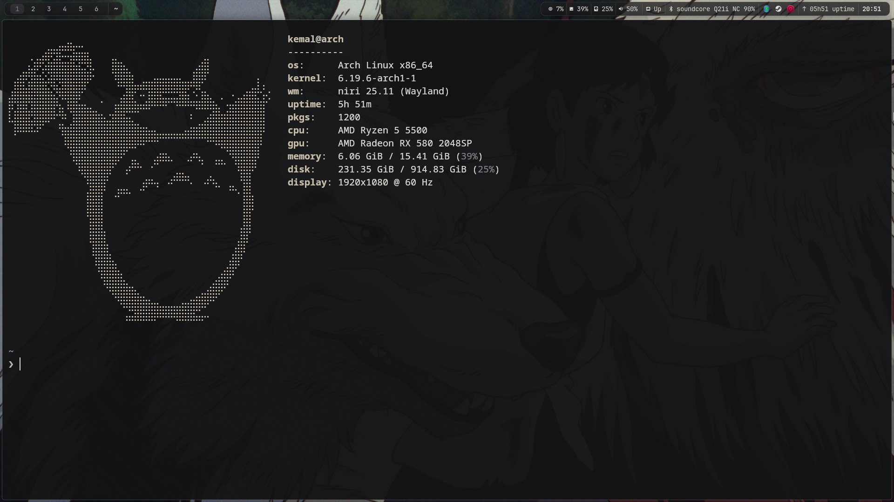
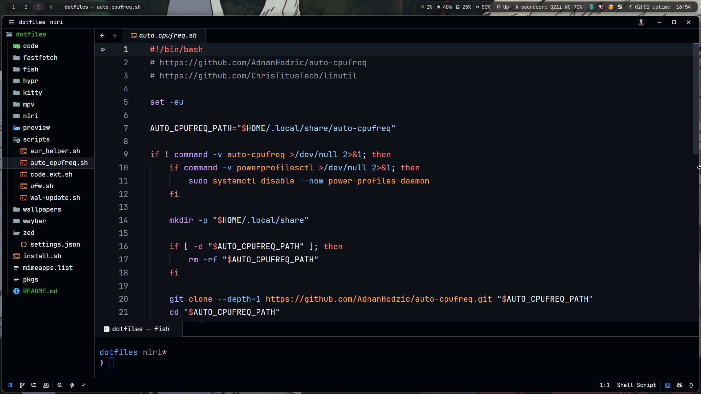
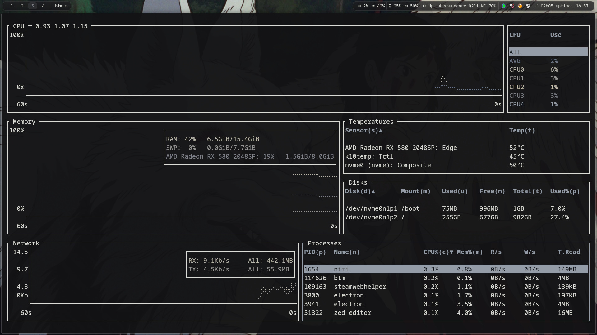

# dotfiles

personal linux dotfiles for my `niri` setup.

## preview

<table>
  <tr>
    <td></td>
    <td></td>
  </tr>
  <tr>
    <td></td>
    <td></td>
  </tr>
</table>

## what's included

- `niri/` - compositor config
- `waybar/` - status bar
- `hypr/` - hyprlock config
- `swww/` - wallpaper management
- `kitty/` - terminal
- `fish/` - shell config
- `mpv/` - player config with uosc
- `zed/` - editor settings
- `scripts/` - setup helpers (paru, ufw, auto-cpufreq)
- `mimeapps.list` - default apps

## install

**Warning:** This script is highly opinionated and not recommended for existing systems. It assumes Arch with `paru`, changes your default shell to fish, overwrites configs in `~/.config`, enables system services, and configures greetd for niri-session.

`install.sh`:
1. Installs paru and packages from `pkgs`
2. Sets fish as shell, installs bun
3. Copies configs to `~/.config`
4. Enables services (fstrim, paccache, bluetooth, greetd, ananicy-cpp)
5. Configures greetd, applies firewall and cpu tuning

## known issues

- steam popup notifications can be annoying when they show up. still didn't figure out a proper fix.
- possible fix: disable steam notifications from `steam -> settings -> notifications -> show notification toasts` and set it to `never`.